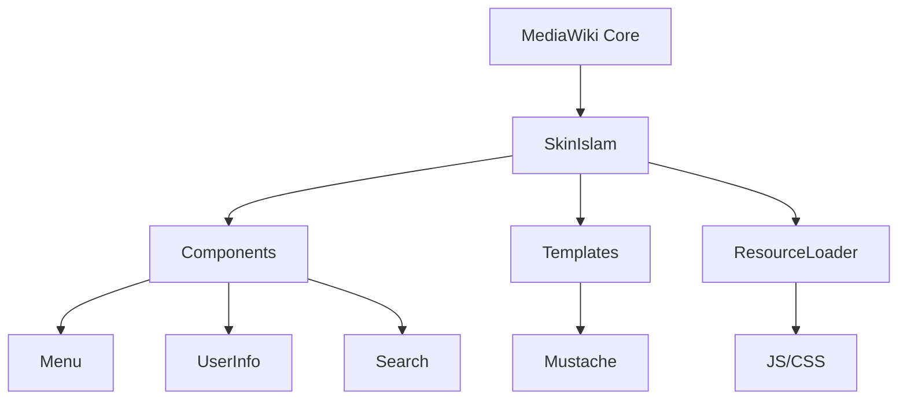
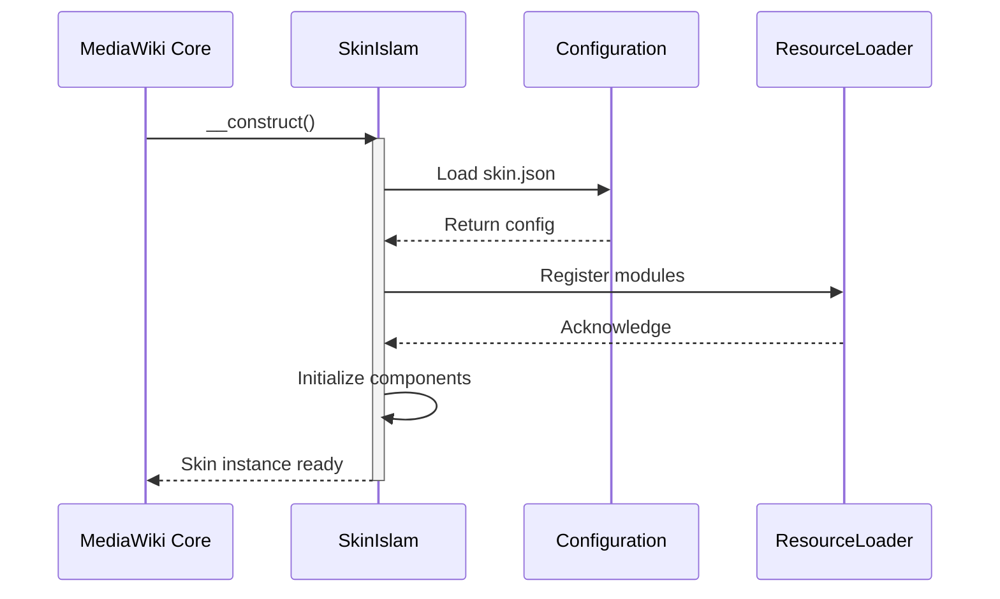
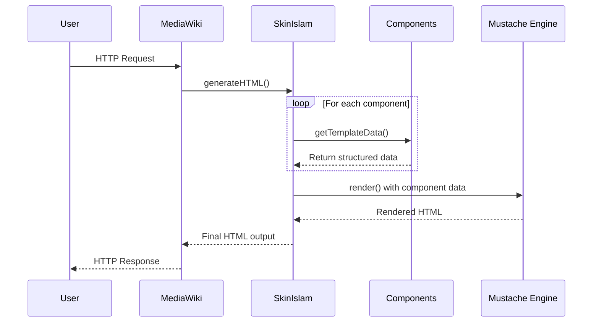
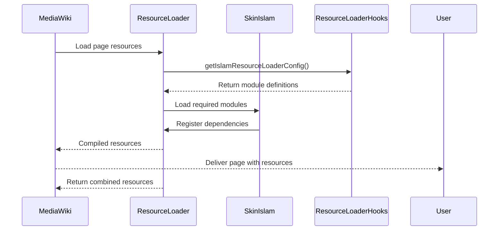
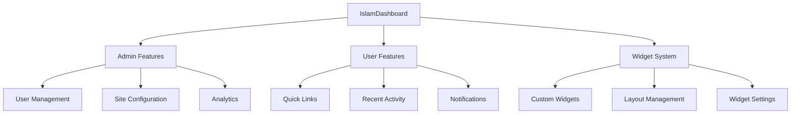
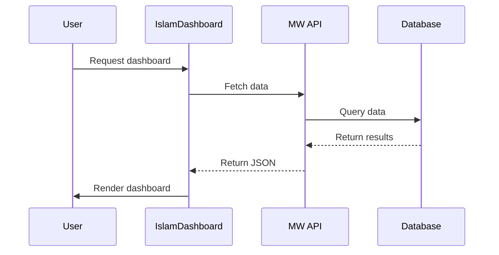

# 🔄 Component Interaction

[]()
[](https://www.mediawiki.org/)

## 📝 Overview

This document provides a detailed illustration of how different components within the Islam skin interact with each other. Understanding these interactions is essential for:

- Extending the skin's functionality
- Developing new features like the IslamDashboard
- Debugging and maintenance
- Performance optimization

## 🏗 Architecture Overview



## 🔄 Core Interaction Flow

### 1. Initialization Sequence



### 2. Page Rendering Process



## 🧩 Component Interactions

### 1. Menu System

```mermaid
sequenceDiagram
    participant Skin as SkinIslam
    participant Menu as IslamComponentMenu
    participant MenuItem as IslamComponentMenuListItem
    participant Link as IslamComponentLink
    
    Skin->>Menu: new()
    activate Menu
    
    loop For each menu item
        Menu->>MenuItem: create()
        MenuItem->>Link: new()
        Link-->>MenuItem: Return link HTML
        MenuItem-->>Menu: Return item data
    end
    
    Menu-->>Skin: Return complete menu structure
    deactivate Menu
    
    Skin->>Template: Render menu with data
```

### 2. Resource Loading



## Key Interaction Patterns

### 1. Component Data Flow
1. **Initialization**: Skin creates component instances
2. **Data Preparation**: Components prepare their template data
3. **Rendering**: Skin passes data to Mustache templates
4. **Output**: Rendered HTML is returned to MediaWiki

### 2. Event Handling
1. **Server-Side**: Hooks modify behavior
2. **Client-Side**: JavaScript handles interactions
3. **Updates**: Dynamic content is loaded as needed

### 3. Extension Integration
1. **Hooks**: Extend functionality via MediaWiki hooks
2. **Templates**: Override or extend templates
3. **Styles**: Customize via LESS variables and overrides

## IslamDashboard Integration Points

### 1. Dashboard Component


### 2. Data Flow for Dashboard


## Best Practices for Extension

1. **Component Reuse**
   - Leverage existing components when possible
   - Follow the same patterns as core components
   - Keep components focused and reusable

2. **Data Management**
   - Use MediaWiki's API for data fetching
   - Implement proper caching
   - Handle errors gracefully

3. **Performance**
   - Lazy load dashboard components
   - Optimize database queries
   - Minimize resource usage

4. **Security**
   - Validate all user input
   - Implement proper permissions
   - Sanitize output

## Example: Adding a New Dashboard Widget

1. **Create Component**
   ```php
   class IslamDashboardWidgetExample extends IslamComponent {
       public function getTemplateData() {
           return [
               'title' => wfMessage('example-widget-title'),
               'content' => $this->getContent(),
           ];
       }
   }
   ```

2. **Register Widget**
   ```php
   $wgHooks['IslamDashboardWidgets'][] = function(&$widgets) {
       $widgets[] = 'example';
       return true;
   };
   ```

3. **Add Template**
   ```mustache
   <div class="islam-dashboard-widget islam-dashboard-widget-example">
       <h3>{{title}}</h3>
       <div class="widget-content">
           {{{content}}}
       </div>
   </div>
   ```

4. **Add Styles**
   ```less
   .islam-dashboard-widget-example {
       .islam-dashboard-widget();
       
       .widget-content {
           padding: 1em;
       }
   }
   ```

This documentation provides a comprehensive overview of how components interact within the Islam skin, which will be invaluable when developing the IslamDashboard extension.
