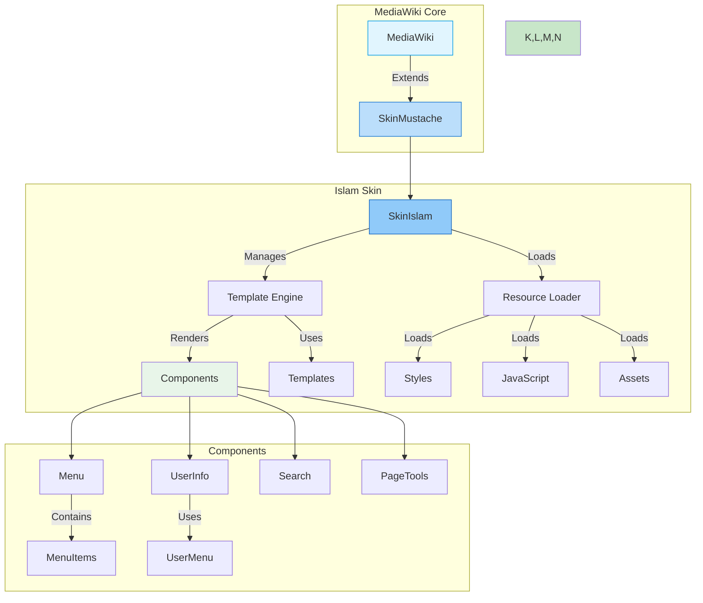
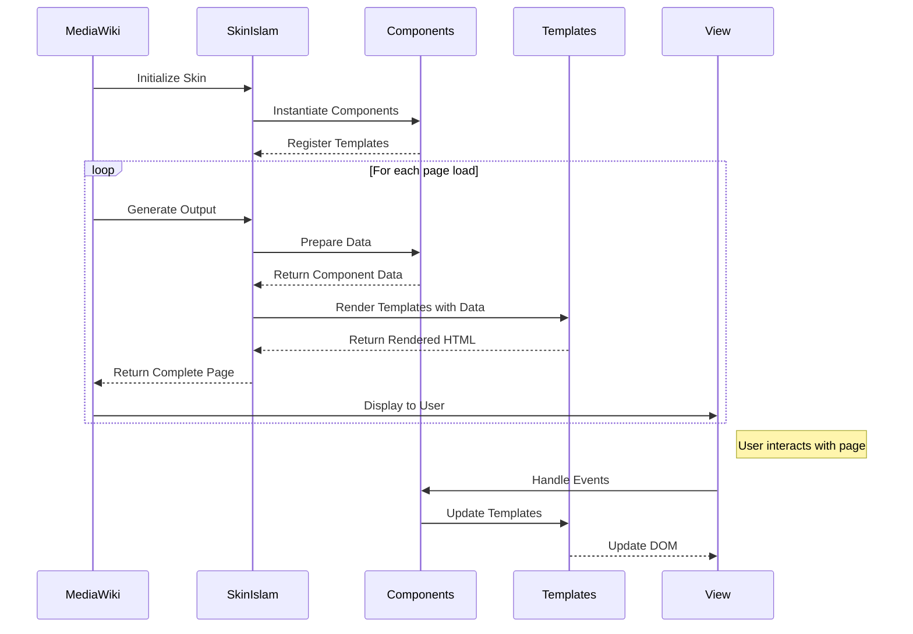
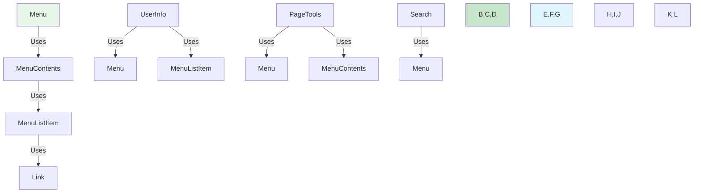
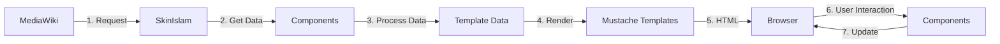
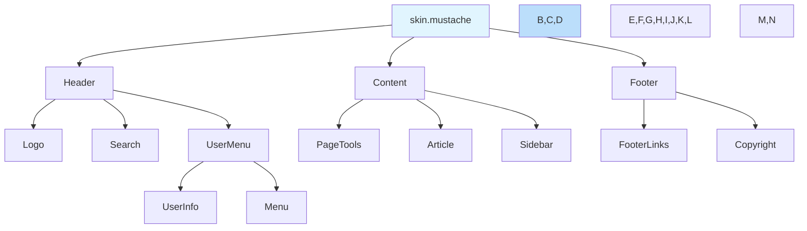
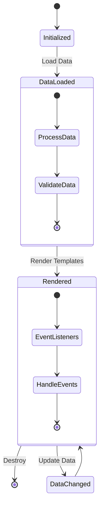
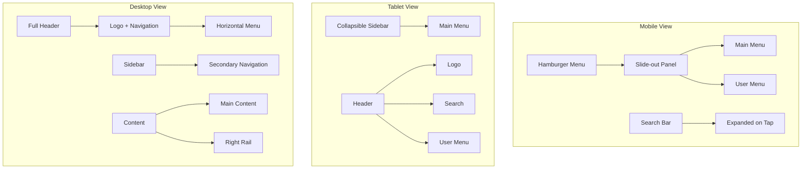
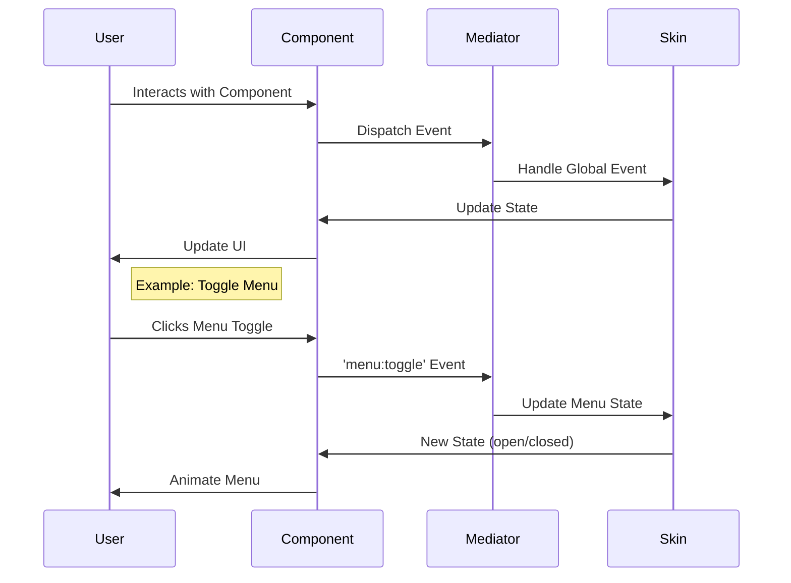

# Component Relationships

> **Version Compatibility**: MediaWiki 1.43+

## 📊 Overview

This document provides detailed diagrams and explanations of the relationships between components in the Islam skin. These visualizations help understand how different parts of the skin interact and work together.

## 🏗️ High-Level Architecture

## 🔄 Component Interaction Diagram

## 📦 Component Dependencies

## 🔄 Data Flow

## 🏗️ Template Hierarchy

## 🛠️ Component Lifecycle

## 📱 Responsive Layout

## 🔄 Event Flow

## 📚 Related Documents

- [Architecture Overview](./overview.md)
- [Component Documentation](../components/README.md)
- [Template Guide](../templates/README.md)
- [Styling Architecture](./styling.md)

## 📝 Version History

| Version | Changes |
|---------|---------|
| 1.0.0   | Initial release |
| 1.1.0   | Added responsive layout diagrams |
| 1.2.0   | Enhanced component interactions |

## 🤝 Contributing

When updating these diagrams:
1. Keep them in sync with code changes
2. Use consistent styling
3. Update version numbers
4. Document any assumptions

## 🔍 See Also

- [Mermaid.js Documentation](https://mermaid-js.github.io/)
- [MediaWiki Skin Development](https://www.mediawiki.org/wiki/Manual:Skinning)
- [Islam Skin Components](../components/)
