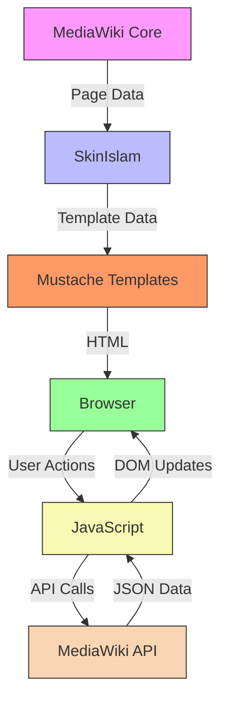
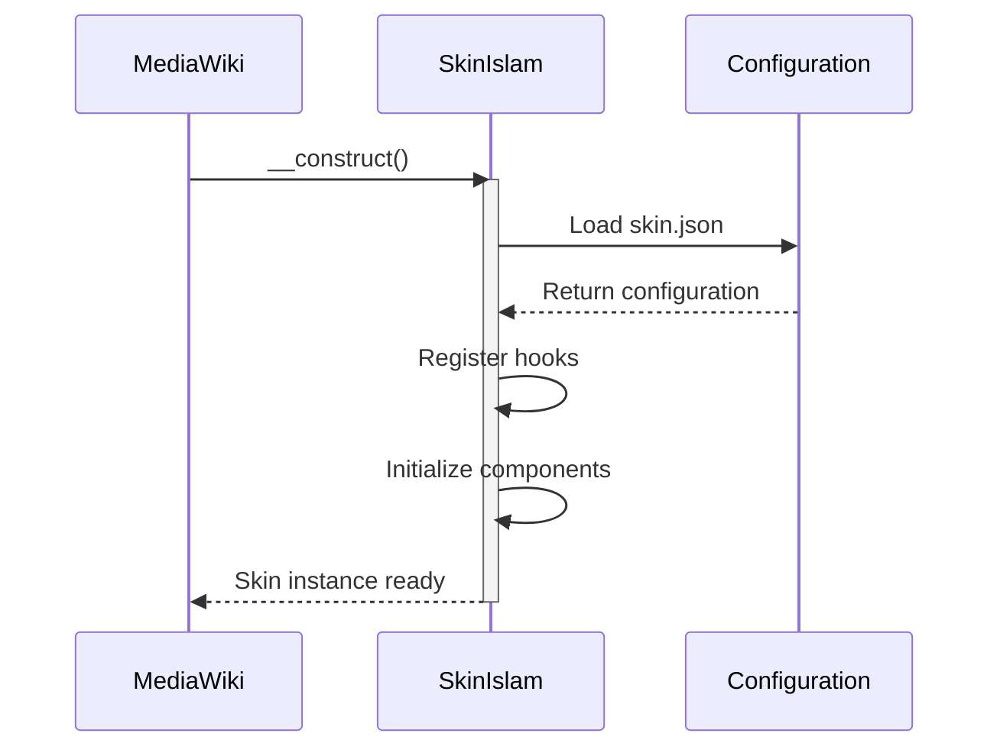
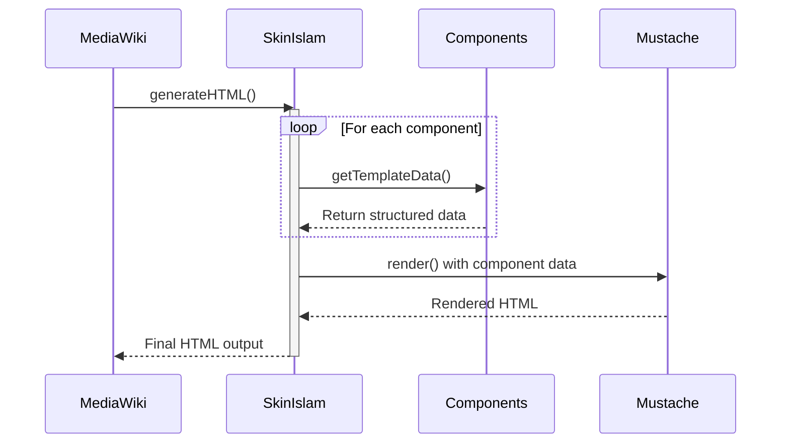
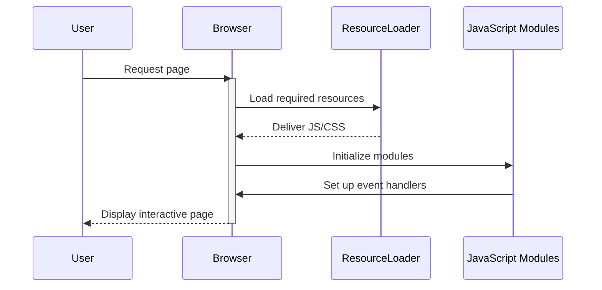
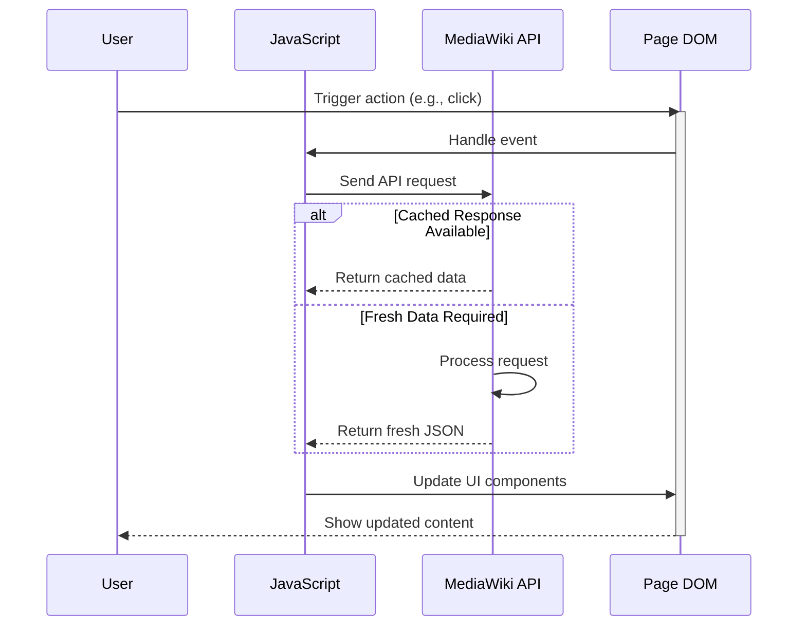
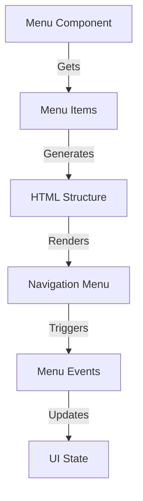
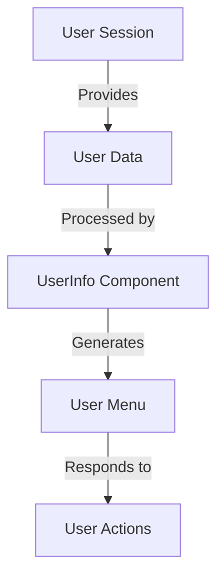
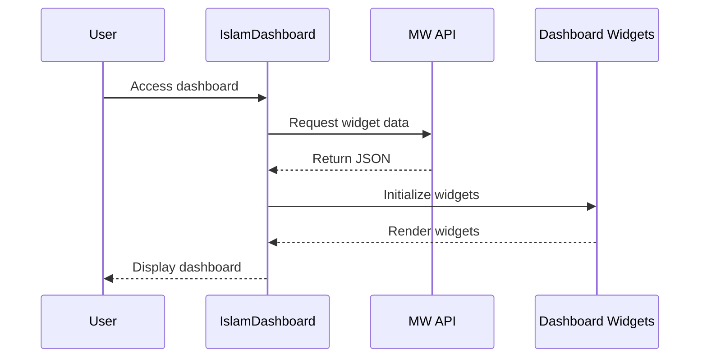
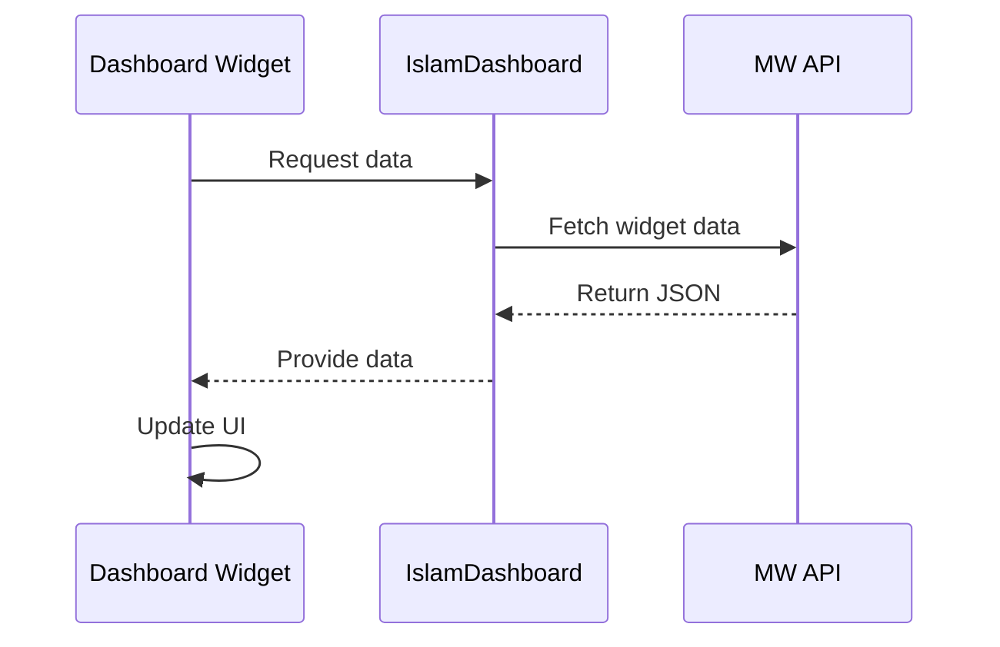

# 📊 Data Flow in Islam Skin

[]()
[](https://www.mediawiki.org/)

## 📝 Overview

This document provides a comprehensive guide to understanding how data moves through the Islam skin, from server-side processing to client-side rendering. A clear understanding of this flow is crucial for:

- Extending the skin's functionality
- Developing new features like the IslamDashboard
- Debugging data-related issues
- Optimizing performance

## 🏗 High-Level Architecture



## 🔄 Data Flow Details

### 1. Server-Side Processing

#### Initialization Phase



#### Page Rendering Process



### 2. Client-Side Processing

#### Initial Page Load



#### Dynamic Content Loading



## 🏗 Data Structures

### 1. Template Data Structure

```typescript
/**
 * Main template data interface for the Islam skin
 */
interface TemplateData {
    // Site-wide data
    'html-site-notice'?: string;
    'html-user-message'?: string;
    
    // Logo configuration
    'data-logos': {
        '1x': string;          // Standard resolution logo
        '2x'?: string;         // High-DPI logo (optional)
        wordmark?: {            // Text-based logo
            src: string;
            width: number;
            height: number;
        };
        // ... other logo variants
    };
        };
    };
    
    // Navigation data
    'data-navigation': Array<{
        id: string;
        'html-items': string;
        label?: string;
        class?: string;
    }>;
    
    // User data
    'data-user-info'?: {
        id: number;
        name: string;
        groups: string[];
        editCount: number;
        registration: string;
    };
    
    // Search data
    'data-search': {
        'form-action': string;
        'html-button-search': string;
        'html-button-search-fallback': string;
        'html-input': string;
    };
    
    // Page tools
    'data-page-tools'?: Array<{
        id: string;
        'html-items': string;
        label?: string;
    }>;
    
    // Content data
    'html-title'?: string;
    'html-subtitle'?: string;
    'html-body-content'?: string;
    'html-categories'?: string;
    
    // Footer data
    'data-footer': {
        'data-info': Array<{
            id: string;
            'html-items': string;
        }>;
        'data-places': Array<{
            id: string;
            'html-items': string;
        }>;
    };
}
```

### 2. Component Data Flow

#### Menu Component


#### User Info Component


## IslamDashboard Data Flow

### 1. Dashboard Initialization


### 2. Widget Data Flow


## Performance Considerations

### 1. Caching Strategies
- **Server-Side**:
  - Use MediaWiki's parser cache
  - Implement component-level caching
  - Cache template rendering results
  
- **Client-Side**:
  - Leverage browser caching
  - Implement data caching in JavaScript
  - Use localStorage for user-specific data

### 2. Data Loading
- **Initial Load**:
  - Include critical data in the initial HTML
  - Defer non-critical resources
  
- **Lazy Loading**:
  - Load widget data asynchronously
  - Implement infinite scrolling for long lists
  - Use intersection observer for below-the-fold content

## Security Considerations

### 1. Data Sanitization
- Always escape user-generated content
- Use MediaWiki's sanitization functions
- Validate all API responses

### 2. Permissions
- Check user permissions before displaying sensitive data
- Implement proper access controls
- Log security-relevant actions

## Debugging Data Flow

### 1. Server-Side Debugging
```php
// Enable debug logging
$wgDebugLogFile = '/path/to/debug.log';
$wgDebugToolbar = true;

// Dump template data
debug_zval_dump($templateData);
```

### 2. Client-Side Debugging
```javascript
// Debug ResourceLoader modules
mw.loader.using('skins.islam.scripts').done(function() {
    console.log('Islam scripts loaded');    
});

// Debug API calls
console.log('API response:', response);
```

## Best Practices

### 1. Data Handling
- Keep data transformations minimal
- Cache expensive operations
- Validate all inputs

### 2. Performance
- Minimize data transfer
- Use efficient data structures
- Implement proper error handling

### 3. Maintainability
- Document data structures
- Follow consistent naming conventions
- Write unit tests for data transformations
