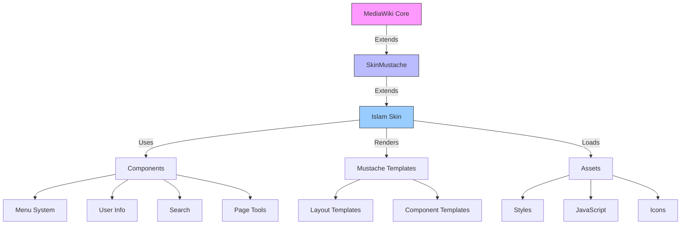
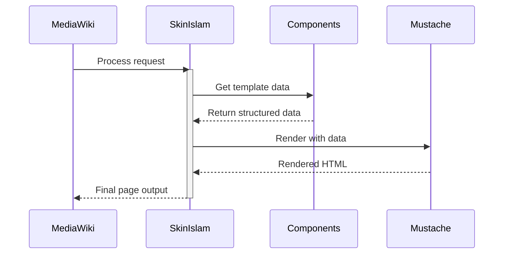
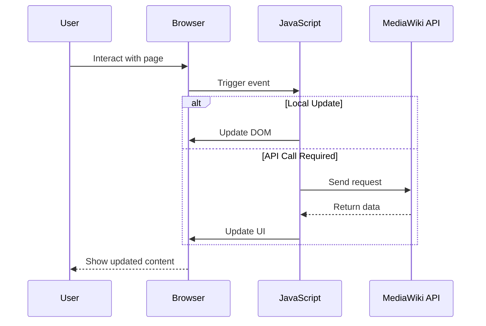

# 🏗 Islam Skin Architecture

[]()
[](https://www.mediawiki.org/)
[](https://www.gnu.org/licenses/gpl-3.0)

## 📝 Overview

The Islam skin is built on a modern, component-based architecture that extends MediaWiki's skinning system. This document provides a comprehensive overview of the skin's architecture, design principles, and integration points.



## 🏗 Core Components

### 1. Skin Class (`SkinIslam`)

**Location**: `includes/SkinIslam.php`

**Responsibilities**:
- Main entry point for the skin
- Extends MediaWiki's `SkinMustache`
- Manages template data and configurations
- Handles resource loading and initialization
- Implements skin-specific hooks

**Key Methods**:
- `getTemplateData()`: Prepares data for Mustache templates
- `getComponent()`: Retrieves component instances
- `setupTemplate()`: Sets up the template engine

### 2. Component System

**Location**: `includes/Components/`

**Purpose**:
Encapsulates UI elements into reusable, self-contained components that can be composed to build complex interfaces.

**Key Components**:
- `IslamComponentMenu`: Manages navigation menus
- `IslamComponentUserInfo`: Handles user-related UI elements
- `IslamComponentLink`: Standardized link component
- `IslamComponentMenuListItem`: Individual menu item component

**Component Lifecycle**:
1. Instantiation
2. Data preparation
3. Template rendering
4. Client-side initialization (if applicable)

### 3. Template System

**Location**: `templates/`

**Technology**:
- [Mustache](https://mustache.github.io/) templating engine
- Logic-less templates for clean separation of concerns
- Partials for reusable template fragments

**Key Templates**:
- `MainMenu.mustache`: Main navigation structure
- `UserInfo.mustache`: User profile and menu
- Component templates in `templates/components/`

**Template Organization**:
```
templates/
├── components/    # Reusable UI components
├── layouts/       # Page layout templates
└── partials/      # Reusable template fragments
```

### 4. Resource Management

**Location**: `resources/`

**Components**:
- **Styles**:
  - LESS-based theming system
  - Modular CSS architecture
  - Responsive design patterns
  
- **Scripts**:
  - Modular JavaScript
  - Event delegation
  - Progressive enhancement
  
- **Assets**:
  - Vector icons
  - Images and media
  - Web fonts

## 🔄 Data Flow

### 1. Server-Side Processing



### 2. Client-Side Processing



## 🔌 Extension Points

### 1. Hooks System

**Location**: `includes/Hooks/`

**Key Hooks**:
- `SkinTemplateNavigation`: Modify navigation menus
- `BeforePageDisplay`: Add resources to page
- `ResourceLoaderGetConfigVars`: Pass configuration to JavaScript
- `SkinTemplateOutputPageBeforeExec`: Modify template data

**Example**:
```php
// Registering a hook
$wgHooks['SkinTemplateNavigation'][] = 'MyExtensionHooks::onSkinTemplateNavigation';
```

### 2. Component Extension

**Extending Components**:
1. Create a new class extending the base component
2. Override methods as needed
3. Register the component in your extension

**Example**:
```php
class MyCustomMenu extends IslamComponentMenu {
    public function getTemplateData() {
        $data = parent::getTemplateData();
        // Customize template data
        return $data;
    }
}
```

### 3. Theming System

**Customization Options**:
1. **Variables**: Override LESS variables
2. **Skins**: Create custom skin variants
3. **Components**: Style individual components

**Example**:
```less
// In your extension's LESS file
@background-color: #f5f5f5;
@link-color: #0066cc;

// Import the base skin styles
@import 'mediawiki.skin.variables.less';
```

## 🔄 Integration with MediaWiki

The Islam skin integrates with various MediaWiki systems to provide a seamless experience:

### 1. ResourceLoader
- Manages CSS and JavaScript resources
- Handles dependency management
- Supports lazy loading

### 2. User Preferences
- Theme selection
- Layout preferences
- Feature toggles

### 3. Extensions
- Compatible with popular extensions
- Provides extension points
- Follows extension guidelines

## Best Practices

### 1. Component Development
- Single Responsibility Principle
- Reusable and configurable
- Documented props and events

### 2. Styling
- Use design tokens
- Follow BEM methodology
- Mobile-first approach

### 3. Performance
- Lazy load non-critical resources
- Optimize assets
- Minimize DOM manipulations

## Future Considerations

### 1. Modern JavaScript
- Consider using Vue.js or React
- Improve component reusability
- Enhance developer experience

### 2. Design System
- Expand design tokens
- Improve documentation
- Create a style guide

### 3. Accessibility
- Improve keyboard navigation
- Enhance screen reader support
- Follow WCAG guidelines

## IslamDashboard Integration

### 1. Architecture
- Create as a separate extension
- Leverage existing skin components
- Follow same architectural patterns

### 2. Components
- Dashboard layout
- Widget system
- Admin controls

### 3. Data Management
- Use existing APIs
- Implement caching
- Support real-time updates

## Conclusion

The Islam skin's architecture is designed to be modular, maintainable, and extensible. By following the established patterns and leveraging the extension points, developers can easily customize and extend the skin to meet their needs.
