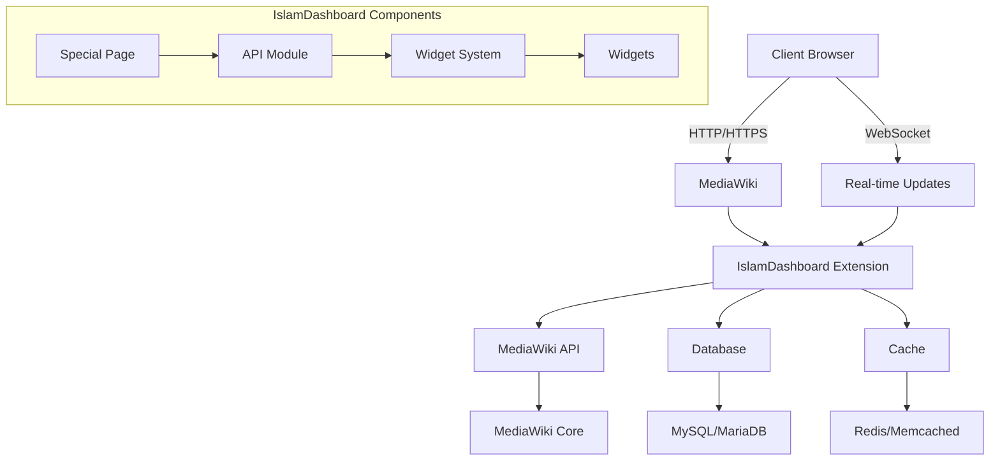
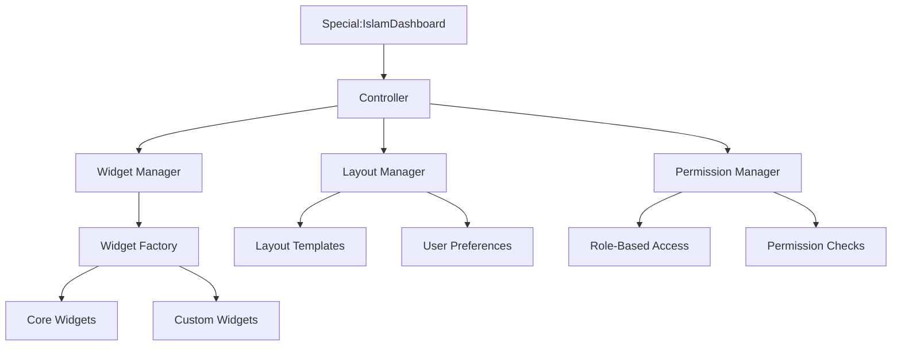

# IslamDashboard - Technical Design Document

## 1. Architecture Overview

### 1.1 System Architecture


### 1.2 Component Diagram


## 2. Database Schema

### 2.1 Tables

#### islamdashboard_layouts
```sql
CREATE TABLE islamdashboard_layouts (
    layout_id INT UNSIGNED AUTO_INCREMENT PRIMARY KEY,
    user_id INT UNSIGNED NOT NULL,
    layout_name VARCHAR(255) NOT NULL,
    layout_data MEDIUMTEXT NOT NULL,
    is_default TINYINT(1) NOT NULL DEFAULT 0,
    created_at TIMESTAMP DEFAULT CURRENT_TIMESTAMP,
    updated_at TIMESTAMP DEFAULT CURRENT_TIMESTAMP ON UPDATE CURRENT_TIMESTAMP,
    FOREIGN KEY (user_id) REFERENCES user(user_id) ON DELETE CASCADE,
    INDEX (user_id)
) ENGINE=InnoDB DEFAULT CHARSET=utf8mb4;
```

#### islamdashboard_widgets
```sql
CREATE TABLE islamdashboard_widgets (
    widget_id VARCHAR(64) PRIMARY KEY,
    widget_name VARCHAR(255) NOT NULL,
    widget_description TEXT,
    widget_class VARCHAR(255) NOT NULL,
    default_config TEXT,
    is_system TINYINT(1) NOT NULL DEFAULT 1,
    created_at TIMESTAMP DEFAULT CURRENT_TIMESTAMP,
    updated_at TIMESTAMP DEFAULT CURRENT_TIMESTAMP ON UPDATE CURRENT_TIMESTAMP,
    INDEX (widget_class)
) ENGINE=InnoDB DEFAULT CHARSET=utf8mb4;
```

#### islamdashboard_user_widgets
```sql
CREATE TABLE islamdashboard_user_widgets (
    user_widget_id INT UNSIGNED AUTO_INCREMENT PRIMARY KEY,
    user_id INT UNSIGNED NOT NULL,
    widget_id VARCHAR(64) NOT NULL,
    layout_id INT UNSIGNED NOT NULL,
    widget_config TEXT,
    widget_position INT UNSIGNED NOT NULL DEFAULT 0,
    is_visible TINYINT(1) NOT NULL DEFAULT 1,
    created_at TIMESTAMP DEFAULT CURRENT_TIMESTAMP,
    updated_at TIMESTAMP DEFAULT CURRENT_TIMESTAMP ON UPDATE CURRENT_TIMESTAMP,
    FOREIGN KEY (user_id) REFERENCES user(user_id) ON DELETE CASCADE,
    FOREIGN KEY (widget_id) REFERENCES islamdashboard_widgets(widget_id) ON DELETE CASCADE,
    FOREIGN KEY (layout_id) REFERENCES islamdashboard_layouts(layout_id) ON DELETE CASCADE,
    INDEX (user_id, layout_id)
) ENGINE=InnoDB DEFAULT CHARSET=utf8mb4;
```

#### islamdashboard_widget_cache
```sql
CREATE TABLE islamdashboard_widget_cache (
    cache_key VARCHAR(255) PRIMARY KEY,
    widget_id VARCHAR(64) NOT NULL,
    cache_data MEDIUMTEXT NOT NULL,
    expires_at TIMESTAMP NOT NULL,
    created_at TIMESTAMP DEFAULT CURRENT_TIMESTAMP,
    INDEX (widget_id, expires_at)
) ENGINE=InnoDB DEFAULT CHARSET=utf8mb4;
```

## 3. API Endpoints

### 3.1 REST API

#### GET /api/rest_v1/dashboard/layouts
- **Description**: Get all dashboard layouts for the current user
- **Parameters**: None
- **Response**:
  ```json
  {
    "layouts": [
      {
        "id": 1,
        "name": "Default Layout",
        "is_default": true,
        "created_at": "2025-07-11T10:00:00Z",
        "updated_at": "2025-07-11T10:00:00Z"
      }
    ]
  }
  ```

#### POST /api/rest_v1/dashboard/layouts
- **Description**: Create a new dashboard layout
- **Request Body**:
  ```json
  {
    "name": "My Custom Layout",
    "is_default": false
  }
  ```
- **Response**:
  ```json
  {
    "layout": {
      "id": 2,
      "name": "My Custom Layout",
      "is_default": false,
      "created_at": "2025-07-11T10:05:00Z",
      "updated_at": "2025-07-11T10:05:00Z"
    }
  }
  ```

#### GET /api/rest_v1/dashboard/widgets
- **Description**: Get available widgets
- **Parameters**: None
- **Response**:
  ```json
  {
    "widgets": [
      {
        "id": "recent-changes",
        "name": "Recent Changes",
        "description": "Shows recent changes to the wiki",
        "icon": "history"
      }
    ]
  }
  ```

## 4. Widget System

### 4.1 Widget Interface
```php
interface IslamDashboardWidgetInterface {
    /**
     * Get widget ID
     */
    public static function getId(): string;
    
    /**
     * Get widget name
     */
    public static function getName(): string;
    
    /**
     * Get widget description
     */
    public static function getDescription(): string;
    
    /**
     * Get widget configuration schema
     */
    public static function getConfigSchema(): array;
    
    /**
     * Get widget data
     */
    public function getData(array $config = []): array;
    
    /**
     * Render widget
     */
    public function render(array $data): string;
}
```

### 4.2 Example Widget Implementation
```php
class RecentChangesWidget implements IslamDashboardWidgetInterface {
    public static function getId(): string {
        return 'recent-changes';
    }
    
    public static function getName(): string {
        return wfMessage('islamdashboard-recentchanges-name')->text();
    }
    
    public static function getDescription(): string {
        return wfMessage('islamdashboard-recentchanges-desc')->text();
    }
    
    public static function getConfigSchema(): array {
        return [
            'limit' => [
                'type' => 'number',
                'label' => wfMessage('islamdashboard-recentchanges-limit')->text(),
                'default' => 10,
                'min' => 1,
                'max' => 50
            ],
            'show_bots' => [
                'type' => 'boolean',
                'label' => wfMessage('islamdashboard-recentchanges-show-bots')->text(),
                'default' => false
            ]
        ];
    }
    
    public function getData(array $config = []): array {
        $config = array_merge([
            'limit' => 10,
            'show_bots' => false
        ], $config);
        
        $dbr = wfGetDB(DB_REPLICA);
        $res = $dbr->select(
            ['recentchanges', 'page', 'actor'],
            [
                'rc_id',
                'rc_timestamp',
                'rc_title',
                'rc_namespace',
                'rc_comment_text AS comment',
                'actor_name AS user_name',
                'actor_user AS user_id',
                'page_latest',
                'rc_this_oldid',
                'rc_last_oldid',
                'rc_type',
                'rc_minor',
                'rc_bot',
                'rc_new',
                'rc_cur_id',
                'rc_deleted',
                'rc_logid',
                'rc_log_type',
                'rc_log_action',
                'rc_params'
            ],
            $this->getConditions($config),
            __METHOD__,
            [
                'ORDER BY' => 'rc_timestamp DESC',
                'LIMIT' => (int)$config['limit']
            ],
            [
                'page' => ['INNER JOIN', 'rc_cur_id=page_id'],
                'actor' => ['JOIN', 'actor_id=rc_actor']
            ]
        );
        
        $changes = [];
        foreach ($res as $row) {
            $title = Title::makeTitle($row->rc_namespace, $row->rc_title);
            $changes[] = [
                'id' => (int)$row->rc_id,
                'title' => $title->getPrefixedText(),
                'url' => $title->getFullURL(),
                'timestamp' => wfTimestamp(TS_ISO_8601, $row->rc_timestamp),
                'user' => [
                    'id' => (int)$row->user_id,
                    'name' => $row->user_name
                ],
                'comment' => $row->comment,
                'type' => (int)$row->rc_type,
                'is_new' => (bool)$row->rc_new,
                'is_minor' => (bool)$row->rc_minor,
                'is_bot' => (bool)$row->rc_bot,
                'revision_id' => (int)$row->page_latest,
                'old_revision_id' => (int)$row->rc_last_oldid
            ];
        }
        
        return [
            'changes' => $changes,
            'count' => count($changes)
        ];
    }
    
    public function render(array $data): string {
        return MustacheEngine::getInstance()->render('widgets/recent-changes.mustache', [
            'changes' => $data['changes'],
            'count' => $data['count']
        ]);
    }
    
    private function getConditions(array $config): array {
        $conditions = [
            'rc_bot' => $config['show_bots'] ? null : 0,
            'rc_type != ' . RC_EXTERNAL,
            'rc_type != ' . RC_CATEGORIZE
        ];
        
        // Filter out log entries if not showing bots
        if (!$config['show_bots']) {
            $conditions[] = 'rc_log_type IS NULL';
        }
        
        return array_filter($conditions);
    }
}
```

## 5. Frontend Architecture

### 5.1 Component Structure
```
resources/
├── src/
│   ├── components/
│   │   ├── Dashboard.vue        # Main dashboard component
│   │   ├── Widget.vue          # Base widget component
│   │   ├── WidgetGrid.vue      # Grid layout manager
│   │   ├── WidgetMenu.vue      # Widget selector
│   │   └── WidgetSettings.vue  # Widget configuration
│   ├── widgets/                # Individual widget components
│   │   ├── RecentChanges.vue
│   │   ├── SiteStats.vue
│   │   └── ...
│   ├── store/                  # Vuex store
│   │   ├── index.js
│   │   ├── modules/
│   │   │   ├── dashboard.js
│   │   │   ├── widgets.js
│   │   │   └── user.js
│   ├── services/               # API services
│   │   ├── api.js
│   │   ├── dashboard.js
│   │   └── widgets.js
│   └── utils/                  # Utility functions
│       ├── event-bus.js
│       └── helpers.js
└── styles/
    ├── _variables.less
    ├── _mixins.less
    ├── dashboard.less
    └── widgets/
        ├── _base.less
        ├── recent-changes.less
        └── ...
```

### 5.2 Vuex Store Structure
```javascript
// store/modules/dashboard.js
export default {
  namespaced: true,
  state: {
    layouts: [],
    currentLayout: null,
    isLoading: false,
    error: null
  },
  mutations: {
    SET_LAYOUTS(state, layouts) {
      state.layouts = layouts;
    },
    SET_CURRENT_LAYOUT(state, layout) {
      state.currentLayout = layout;
    },
    SET_LOADING(state, isLoading) {
      state.isLoading = isLoading;
    },
    SET_ERROR(state, error) {
      state.error = error;
    }
  },
  actions: {
    async fetchLayouts({ commit }) {
      try {
        commit('SET_LOADING', true);
        const response = await dashboardService.getLayouts();
        commit('SET_LAYOUTS', response.data.layouts);
        return response.data;
      } catch (error) {
        commit('SET_ERROR', error);
        throw error;
      } finally {
        commit('SET_LOADING', false);
      }
    },
    // Other actions...
  },
  getters: {
    defaultLayout: state => {
      return state.layouts.find(layout => layout.is_default) || state.layouts[0];
    }
  }
};
```

## 6. Security Considerations

### 6.1 Input Validation
- All user input must be validated on both client and server side
- Use MediaWiki's parameter validation utilities
- Sanitize all data before processing

### 6.2 CSRF Protection
- Implement CSRF tokens for all state-changing operations
- Use MediaWiki's built-in CSRF protection mechanisms
- Validate referer headers

### 6.3 Permission Checks
- Verify user permissions for each API endpoint
- Implement row-level security where appropriate
- Log all permission-related denials

### 6.4 Rate Limiting
- Implement rate limiting for API endpoints
- Use MediaWiki's rate limiting system
- Set appropriate limits for different types of requests

## 7. Performance Optimization

### 7.1 Caching Strategy
- Cache widget data with appropriate TTL
- Use different cache backends based on data volatility
- Implement cache invalidation on content changes

### 7.2 Lazy Loading
- Load widget data asynchronously
- Implement infinite scrolling for large datasets
- Defer non-critical resources

### 7.3 Database Optimization
- Add appropriate indexes for frequently queried columns
- Optimize complex queries
- Use read replicas for reporting queries

## 8. Internationalization

### 8.1 Message Files
- Store all user-facing strings in i18n files
- Support for RTL languages
- Use MediaWiki's message system

### 8.2 Date/Time Handling
- Use client-side timezone detection
- Format dates according to user preferences
- Support for different calendar systems

## 9. Testing Strategy

### 9.1 Unit Tests
- Test individual components in isolation
- Cover edge cases and error conditions
- Mock external dependencies

### 9.2 Integration Tests
- Test component interactions
- Verify API contracts
- Test with different user roles

### 9.3 End-to-End Tests
- Test complete user flows
- Verify cross-browser compatibility
- Test performance under load

## 10. Deployment Plan

### 10.1 Prerequisites
- MediaWiki 1.35+
- PHP 7.4+
- MySQL 5.7+ or MariaDB 10.3+
- Node.js 14+ (for building assets)

### 10.2 Installation Steps
1. Clone the repository to `extensions/IslamDashboard`
2. Add `wfLoadExtension('IslamDashboard');` to LocalSettings.php
3. Run `composer install`
4. Run `npm install && npm run build`
5. Run the update script: `php maintenance/update.php`

### 10.3 Upgrade Steps
1. Pull the latest changes
2. Run `composer update`
3. Run `npm install && npm run build`
4. Run the update script: `php maintenance/update.php`

## 11. Monitoring and Maintenance

### 11.1 Logging
- Log all important actions
- Include relevant context in log messages
- Use appropriate log levels

### 11.2 Metrics
- Track dashboard usage
- Monitor performance metrics
- Set up alerts for errors

### 11.3 Backup and Recovery
- Regular database backups
- Test restore procedures
- Document disaster recovery plan

## 12. Future Enhancements

### 12.1 Short-term
- [ ] Add more built-in widgets
- [ ] Improve mobile experience
- [ ] Add keyboard navigation

### 12.2 Medium-term
- [ ] Custom widget builder
- [ ] Advanced analytics
- [ ] Integration with external services

### 12.3 Long-term
- [ ] AI-powered insights
- [ ] Predictive analytics
- [ ] Advanced visualization tools
