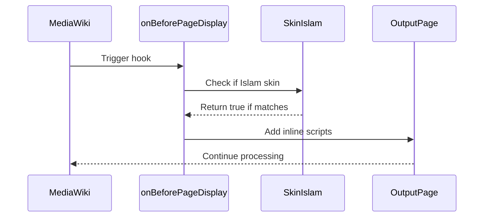

# 🪝 Islam Skin Hooks and Extension Points

[]()
[](https://www.mediawiki.org/)
[](https://www.gnu.org/licenses/gpl-3.0)

## 📝 Overview

This comprehensive guide documents all available hooks and extension points in the Islam skin, enabling developers to customize and extend its functionality. These integration points allow for deep customization while maintaining upgrade safety.

## 📋 Table of Contents

- [Core Skin Hooks](#-core-skin-hooks)
- [Resource Loader Hooks](#-resource-loader-hooks)
- [Extension Points](#-extension-points)
- [Best Practices](#-best-practices)
- [Examples](#-examples)
- [Troubleshooting](#-troubleshooting)

## 🎯 Core Skin Hooks

### SkinHooks Class

Location: `includes/Hooks/SkinHooks.php`

#### 1. `onBeforePageDisplay`



**Purpose**: Injects theme-related JavaScript and styles

**Parameters**:
- `OutputPage $out`: The output page object
- `Skin $skin`: The current skin instance

**Usage Example**:
```php
// In extension.json or LocalSettings.php
$wgHooks['BeforePageDisplay'][] = 'MyExtensionHooks::onBeforePageDisplay';

// Implementation
public static function onBeforePageDisplay( OutputPage $out, Skin $skin ) {
    if ( $skin->getSkinName() === 'islam' ) {
        $out->addInlineScript( '/* custom JS */' );
    }
    return true;
}
```

#### 2. `onOutputPageAfterGetHeadLinksArray`

**Purpose**: Modifies viewport meta tag for better mobile support

**Key Features**:
- Adds `viewport-fit=cover` for modern devices
- Ensures proper scaling on all screen sizes
- Maintains compatibility with various browsers

#### 3. `onSidebarBeforeOutput`

**Purpose**: Customizes toolbox links before rendering

**Customization Options**:
- Add/remove/modify toolbox items
- Add icons to menu items
- Conditionally show/hide items based on user permissions

#### 4. `onSkinBuildSidebar`

**Purpose**: Modifies sidebar content and structure

**Common Modifications**:
- Add custom navigation sections
- Filter menu items based on user roles
- Add dynamic content to the sidebar

#### 5. `onSkinPageReadyConfig`

**Purpose**: Configures page-ready JavaScript behavior

**Configuration Options**:
- Disable/enable default modules
- Configure search behavior
- Set up custom event handlers

#### 6. `onSkinTemplateNavigation`

**Purpose**: Modifies all navigation menus

**Menu Types**:
- `namespaces`: Page namespaces
- `views`: View actions
- `actions`: Page actions
- `variants`: Language variants
- `notifications`: User notifications
- `user-menu`: User dropdown menu

## 📦 Resource Loader Hooks

### ResourceLoaderHooks Class

Location: `includes/Hooks/ResourceLoaderHooks.php`

#### 1. `getIslamResourceLoaderConfig`

**Purpose**: Configures core skin behavior

**Available Settings**:
```php
$config = [
    'wgIslamEnablePreferences' => true,     // Enable user preferences
    'wgIslamOverflowInheritedClasses' => [  // CSS classes for overflow handling
        'mw-body',
        'mw-body-inner',
        'mw-content-container'
    ],
    'wgIslamSearchModule' => [              // Search functionality
        'enabled' => true,
        'useAdvancedSearch' => true
    ],
    'wgIslamEnableCommandPalette' => true   // Enable/disable command palette
];
```

#### 2. `getIslamPreferencesResourceLoaderConfig`

**Purpose**: Configures theme and appearance settings

**Theme Options**:
- Light/dark theme support
- Custom color schemes
- Font size adjustments
- Layout preferences

#### 3. `getIslamSearchResourceLoaderConfig`

**Purpose**: Configures search functionality

**Integration Points**:
- AdvancedSearch extension
- MediaSearch extension
- Custom search providers
- Search result formatting

#### 4. `getIslamCommandPaletteResourceLoaderConfig`

**Purpose**: Configures the command palette

**Features**:
- Quick navigation
- Command search
- Keyboard shortcuts
- Plugin system for custom commands

## 🔌 Extension Points

### 1. Menu System

**Location**: `includes/Components/`

**Key Components**:
- `IslamComponentMenu`: Base menu class
- `IslamComponentMenuListItem`: Individual menu items
- `IslamComponentLink`: Link rendering

**Customization Example**:
```php
// Extend the base menu component
class MyCustomMenu extends IslamComponentMenu {
    public function getMenuItems() {
        $items = parent::getMenuItems();
        // Add custom menu item
        $items[] = new IslamComponentMenuListItem([
            'text' => 'Custom Item',
            'href' => '/custom-page',
            'icon' => 'custom-icon',
            'class' => 'custom-menu-item'
        ]);
        return $items;
    }
}
```

### 2. User Interface Components

**Location**: `templates/`

**Key Templates**:
- `UserInfo.mustache`: User profile and menu
- `Menu.mustache`: Navigation menus
- `Search.mustache`: Search interface

**Template Override Example**:
```html
<!-- In your extension's templates/ directory -->
<div class="my-custom-menu">
    {{#items}}
    <a href="{{href}}" class="{{class}}">
        {{#icon}}<span class="icon-{{.}}"></span>{{/icon}}
        <span class="menu-text">{{text}}</span>
    </a>
    {{/items}}
</div>
```
  - `MenuContents.mustache`
  - `MenuListItem.mustache`
- **Customization**:
  - Override templates in extensions
  - Add custom CSS classes
  - Extend with additional data

### 3. Styling
- **Location**: `resources/skins.islam.styles/`
- **Key Files**:
  - `components/` - Component-specific styles
  - `common/` - Common styles and utilities
  - `skinning/` - MediaWiki core overrides
- **Customization**:
  - Override variables in `tokens.less`
  - Add custom styles for components
  - Extend existing styles

## Adding Custom Hooks

### 1. Create a New Hook
```php
// In extension.json or skin.json
"Hooks": {
    "SkinTemplateNavigation::Universal": "MyExtensionHooks::onSkinTemplateNavigation"
}
```

### 2. Implement the Hook
```php
class MyExtensionHooks {
    public static function onSkinTemplateNavigation( $sktemplate, &$links ) {
    }
    
    MyFeature.prototype = {
        initialize: function () {
            this.setupEventHandlers();
        },
        
        setupEventHandlers: function () {
            this.$element.on( 'click', this.onClick.bind( this ) );
        },
        
        onClick: function ( e ) {
            // Handle click event
        }
    };
    
    // Initialize on document ready
    $( function () {
        $( '.my-feature' ).each( function () {
            new MyFeature( this );
        });
    });
    
}( jQuery, mediaWiki ) );
```

## 🛠 Common Tasks

### Adding a New Menu Item

1. **Using Hooks** (Recommended):
   ```php
   public static function onSkinTemplateNavigation( $skin, &$content_navigation ) {
       if ( $skin->getSkinName() !== 'islam' ) {
           return true;
       }
       
       $content_navigation['actions']['custom-action'] = [
           'text' => wfMessage( 'myextension-action-label' )->text(),
           'href' => Title::newFromText( 'Special:MyPage' )->getLocalURL(),
           'class' => 'custom-action',
           'icon' => 'custom-icon'
       ];
       
       return true;
   }
   ```

2. **Using JavaScript** (Client-side):
   ```javascript
   mw.hook( 'islam.menu.ready' ).add( function ( menu ) {
       menu.addItem( {
           text: mw.msg( 'myextension-menu-item' ),
           href: mw.util.getUrl( 'Special:MyPage' ),
           icon: 'custom-icon',
           position: 'before:preferences'
       } );
   } );
   ```

### Overriding a Template

1. **Create Template Directory**:
   ```
   extensions/MyExtension/templates/
   └── components/
       └── Menu.mustache
   ```

2. **Register Template Path**:
   ```json
   {
       "name": "MyExtension",
       "Hooks": {
           "ResourceLoaderGetConfigVars": "MyExtensionHooks::onResourceLoaderGetConfigVars"
       },
       "ResourceModules": {
           "ext.MyExtension.templates": {
               "localBasePath": "resources",
               "remoteExtPath": "MyExtension/resources",
               "targets": [ "desktop", "mobile" ]
           }
       },
       "ResourceFileModulePaths": {
           "localBasePath": "resources",
           "remoteExtPath": "MyExtension/resources"
       }
   }
   ```

3. **Override in PHP**:
   ```php
   public static function onResourceLoaderGetConfigVars( &$vars ) {
       $vars['wgIslamTemplatePaths']['MyExtension'] = __DIR__ . '/templates';
       return true;
   }
   ```

### Adding Custom Styles

1. **Create LESS File**:
   ```less
   // resources/ext.myextension.styles/ext.myextension.less
   @import 'mediawiki.skin.variables.less';
   
   .my-extension-feature {
       background-color: @background-color-base;
       color: @color-base;
       
       // Use skin variables for consistency
       padding: @spacing-100;
       margin-bottom: @spacing-200;
       
       // Responsive design
       @media ( min-width: @width-breakpoint-tablet ) {
           padding: @spacing-200;
       }
   }
   ```

2. **Register Resource**:
   ```json
   {
       "ResourceModules": {
           "ext.myextension.styles": {
               "styles": [
                   "ext.myextension.styles/ext.myextension.less"
               ],
               "targets": [ "desktop", "mobile" ],
               "dependencies": [
                   "mediawiki.skin.variables"
               ]
           }
       }
   }
   ```

## 🐛 Troubleshooting

### Common Issues and Solutions

#### 1. Hooks Not Firing

**Symptoms**:
- Expected functionality not working
- No errors in the browser console or server logs

**Troubleshooting Steps**:
1. Verify hook registration in `extension.json` or `LocalSettings.php`
2. Check for typos in hook names
3. Ensure your hook handler returns `true` (or appropriate value)
4. Add debug logging:
   ```php
   wfDebugLog( 'MyExtension', 'Hook called: ' . __METHOD__ );
   ```

#### 2. Template Overrides Not Working

**Symptoms**:
- Custom templates not being used
- Old template content still showing

**Troubleshooting Steps**:
1. Clear the MediaWiki parser cache
2. Verify template path in `$wgIslamTemplatePaths`
3. Check file permissions
4. Add debug output:
   ```php
   wfDebugLog( 'MyExtension', 'Template path: ' . $templatePath );
   ```

#### 3. Styles Not Applying

**Symptoms**:
- CSS changes not visible
- Styles being overridden

**Troubleshooting Steps**:
1. Check browser developer tools for:
   - 404 errors on CSS files
   - CSS specificity issues
   - Cached resources
2. Verify LESS compilation
3. Check ResourceLoader configuration
4. Add `!important` temporarily to test

#### 4. JavaScript Errors

**Symptoms**:
- Console errors
- Interactive elements not working

**Troubleshooting Steps**:
1. Check browser console for errors
2. Verify module dependencies
3. Ensure jQuery is available
4. Wrap code in `mw.loader.using()` if needed

## 📚 Additional Resources

- [MediaWiki Skinning Guide](https://www.mediawiki.org/wiki/Manual:Skinning)
- [ResourceLoader Documentation](https://www.mediawiki.org/wiki/ResourceLoader)
- [Mustache Templating](https://mustache.github.io/)
- [LESS CSS](http://lesscss.org/)
- [MediaWiki JavaScript Documentation](https://www.mediawiki.org/wiki/Manual:JavaScript/Overview)

## 📄 License

This documentation is licensed under the [GNU General Public License v3.0 or later](https://www.gnu.org/licenses/gpl-3.0).
